<div align="center">

# 🛍️ Lomentra — Multi-Vendor E-Commerce SaaS Platform

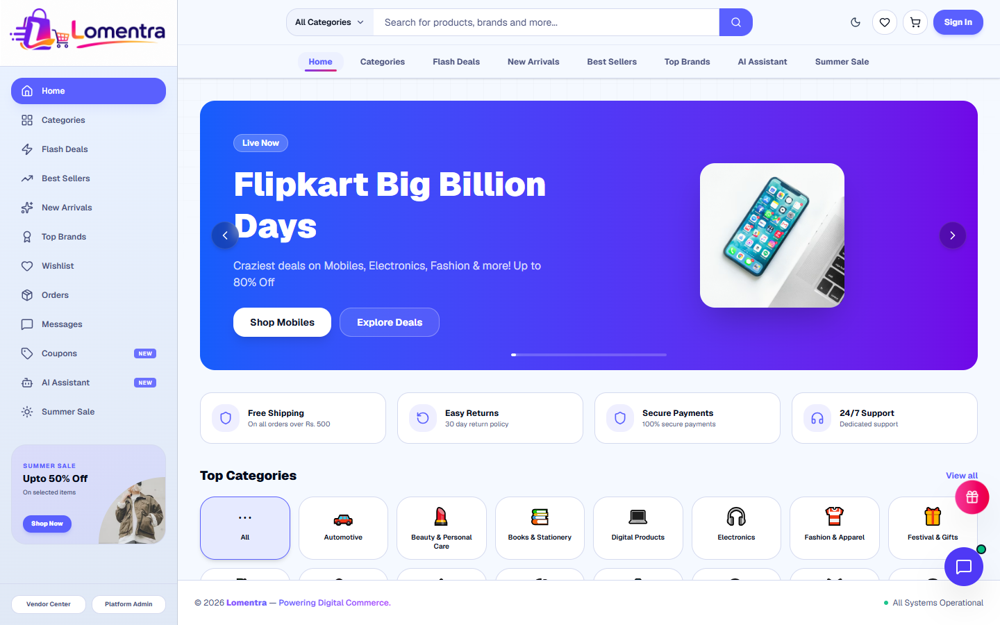

**A full-stack, production-grade multi-vendor e-commerce marketplace** built with Next.js, React 19, TypeScript, MongoDB Atlas, and Tailwind CSS v4.

[](https://lomentramarket.netlify.app/)
[](https://github.com/lomashsrivastava/Lomentra-Multivendor-Ecommerce)
[](https://choosealicense.com/licenses/mit/)

[](https://nextjs.org/)
[](https://reactjs.org/)
[](https://www.typescriptlang.org/)
[](https://www.mongodb.com/atlas)
[](https://tailwindcss.com/)
[](https://netlify.com)
[](https://render.com)

</div>

---

## 📋 Table of Contents

- [🌟 Overview](#-overview)
- [✨ Features](#-features)
- [🛠️ Tech Stack](#️-tech-stack)
- [📸 Screenshots](#-screenshots)
- [🚀 Live Demo & Links](#-live-demo--links)
- [🔑 Test Credentials](#-test-credentials)
- [💻 Local Development](#-local-development)
- [☁️ Deployment Guide](#️-deployment-guide)
  - [Deploy Backend to Render](#deploy-backend-to-render)
  - [Deploy Frontend to Netlify](#deploy-frontend-to-netlify)
- [📁 Project Structure](#-project-structure)
- [📡 API Reference](#-api-reference)

---

## 🌟 Overview

**Lomentra** is a production-ready, AI-powered multi-vendor e-commerce SaaS platform — think Flipkart or Amazon, but self-hosted and fully customizable.

The platform supports **three distinct user roles**:

| Role | Description |
|------|-------------|
| 🛒 **Customer** | Browse, search, wishlist, and purchase products from multiple vendors |
| 🏪 **Vendor** | Manage store, products, inventory, analytics, and request payouts |
| 🛡️ **Platform Admin** | Oversee GMV, approve/reject payouts, audit the split-payment ledger |

Built with a **Vite + React** storefront and a **Next.js App Router** API backend, connected to **MongoDB Atlas** for persistent cloud storage.

---

## ✨ Features

### 🛒 Customer Storefront
- **Dynamic Hero Carousel** — auto-rotating promotional banners with campaign CTAs
- **14+ Category Taxonomy** — Fashion, Electronics, Home, Kitchen, Grocery, Beauty, Sports, Books, Toys, Automotive, Jewelry, Pet Supplies, Digital Products, Festival & Gifts
- **Flash Deals** — time-limited discounts with countdown timers
- **Best Sellers & New Arrivals** — curated product discovery feeds
- **Top Brands** — per-brand storefront pages
- **Summer Sale** — seasonal promotional catalog with parallax hero
- **Advanced Search** — real-time dropdown with product images, prices, and category filters
- **Product Detail Modal** — full-screen view with image gallery, size/color selectors, reviews, and Add to Cart
- **Shopping Cart Drawer** — persistent cart with quantity management and real-time subtotals
- **Wishlist** — save and manage favourite products across sessions

### 🎰 Gamified Coupon System
- **Spin-the-Wheel** — 18-segment animated wheel with 5%–100% OFF tiers (Lomentra & Apple variants)
- **Scratch Cards** — interactive reveal mechanic with win/lose reveal animation
- **Mystery Boxes** — animated 3D box opening with random reward discovery
- Won coupons auto-apply at checkout with backend validation

### 🛍️ Checkout & Orders
- **Express Checkout** — auto-fills address from saved profile
- **Multi-Payment Methods** — UPI/QR Code, Credit/Debit Card, Net Banking, Cash on Delivery
- **Dynamic QR Code** — adapts payee details and amount in real-time
- **INR / USD Currency Toggle** — global currency switching across the entire platform
- **7-Day Order Tracking Timeline** — visual package status with shipment cards
- **Order Cancellation** — cancel pre-shipped orders with automatic stock restoration

### 🏪 Vendor Dashboard
- **Revenue Analytics** — line chart (sales over time) + category donut chart
- **Product Management** — add/edit/delete products with image URLs, SKUs, pricing, stock
- **Inventory Alerts** — auto-flagged low-stock warnings per variant
- **Withdrawal Requests** — request bank payouts from earned revenue
- **Store Profile Editor** — logo, banner, description, and slug management
- **Order Management** — view and manage incoming customer orders
- **Coupon Management** — create and manage store-specific discount coupons

### 🛡️ Platform Admin Console
- **GMV Dashboard** — total gross merchandise value, platform fee accumulation
- **Settlements & Withdrawals** — approve/reject vendor payout requests with audit log
- **Stripe-style Split Ledger** — per-order 90%/10% merchant-platform split audit table
- **Settle All** — one-click bulk disbursement of all pending payouts
- **Global Orders Monitor** — all platform orders with payment + fulfillment status

### 🤖 AI Assistant
- Context-aware shopping assistant for product recommendations, order queries, and general support

### 💬 Messaging
- Customer ↔ Vendor messaging with real-time conversation threads

---

## 🛠️ Tech Stack

| Layer | Technology |
|-------|-----------|
| **Frontend Framework** | React 19, Vite 8, TypeScript 6 |
| **Routing** | React Router v7 |
| **Styling** | Tailwind CSS v4, shadcn/ui components |
| **Icons** | Lucide React |
| **Animations** | Framer Motion |
| **Charts** | Recharts |
| **Backend Framework** | Next.js 16 App Router (API-only) |
| **Database** | MongoDB Atlas (Mongoose v9 ODM) |
| **Authentication** | JWT (Bearer tokens) + bcryptjs |
| **Security** | NoSQL sanitization, rate limiting, CSRF headers |
| **Frontend Hosting** | Netlify |
| **Backend Hosting** | Render |
| **Dev Tools** | MSW (Mock Service Worker), ESLint, Prettier, Vitest |
| **PWA** | vite-plugin-pwa (offline support, installable) |

---

## 📸 Screenshots

### 🏠 Homepage & Hero

<table>
<tr>
<td></td>
<td>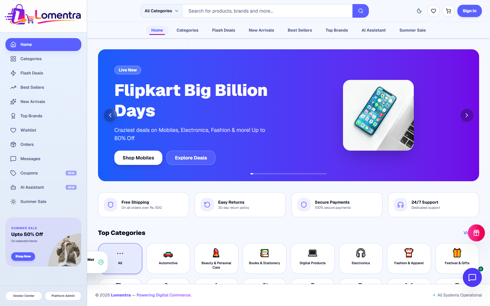</td>
</tr>
<tr>
<td align="center"><b>Hero Banner Carousel</b></td>
<td align="center"><b>Deals & Offers Section</b></td>
</tr>
</table>

<table>
<tr>
<td>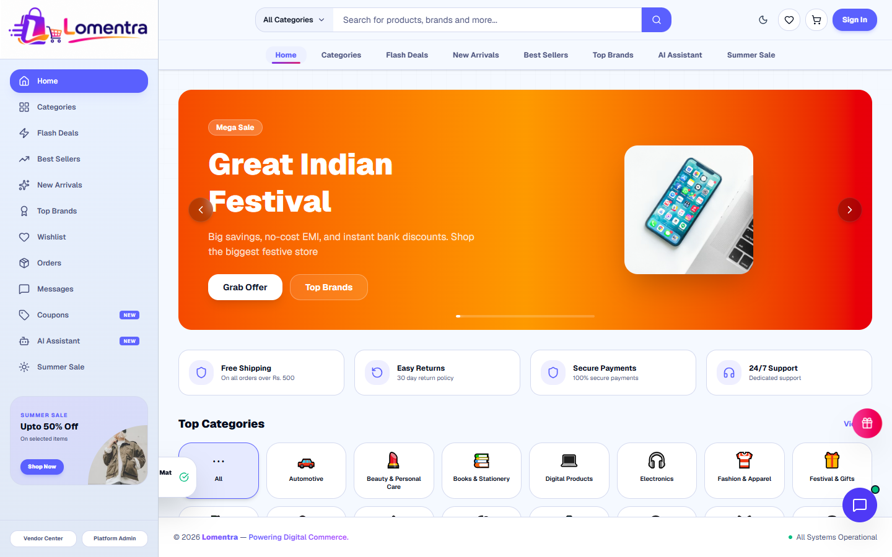</td>
<td></td>
</tr>
<tr>
<td align="center"><b>Top Categories Grid</b></td>
<td align="center"><b>Full Categories Browser</b></td>
</tr>
</table>

---

### 🛍️ Product Discovery Pages

<table>
<tr>
<td>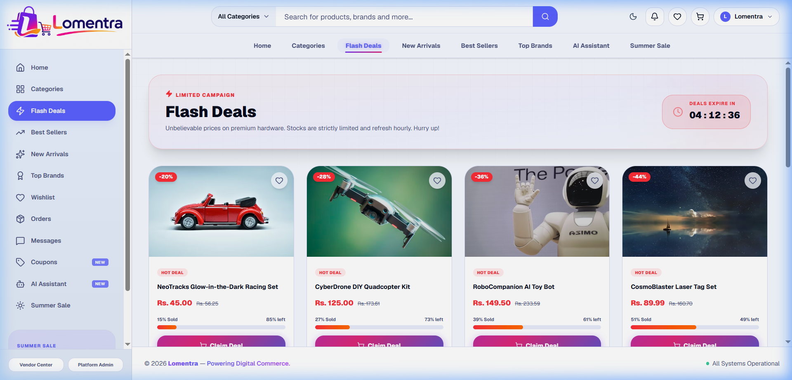</td>
<td>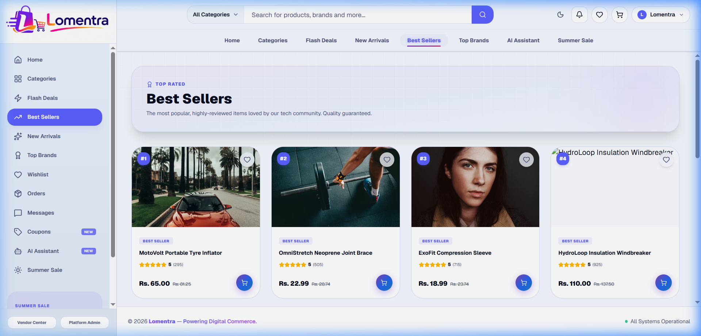</td>
<td>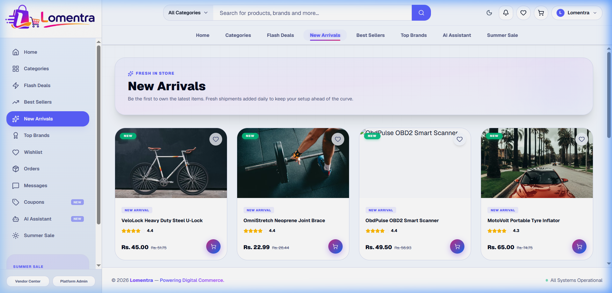</td>
</tr>
<tr>
<td align="center"><b>⚡ Flash Deals</b></td>
<td align="center"><b>🏆 Best Sellers</b></td>
<td align="center"><b>🆕 New Arrivals</b></td>
</tr>
</table>

<table>
<tr>
<td>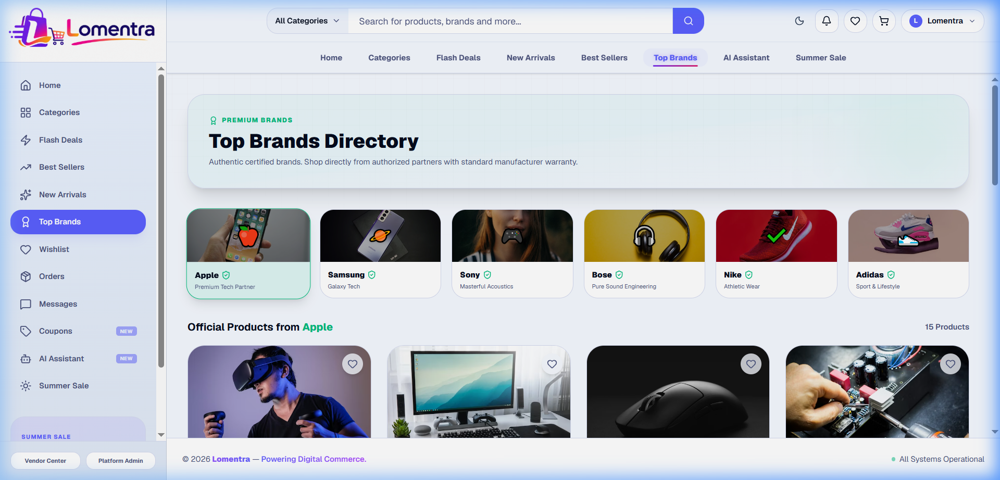</td>
<td>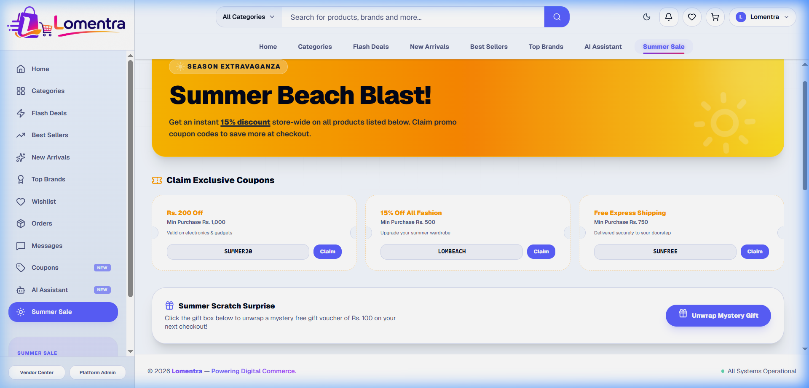</td>
</tr>
<tr>
<td align="center"><b>🏷️ Top Brands</b></td>
<td align="center"><b>☀️ Summer Sale</b></td>
</tr>
</table>

---

### 🛒 Shopping Experience

<table>
<tr>
<td>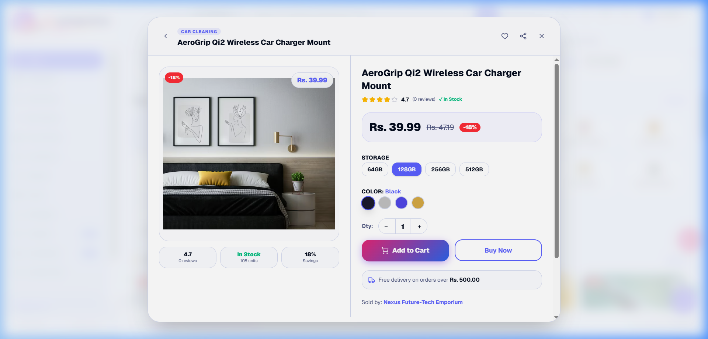</td>
<td>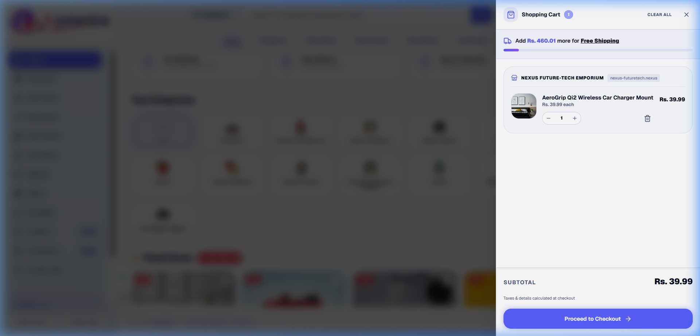</td>
<td>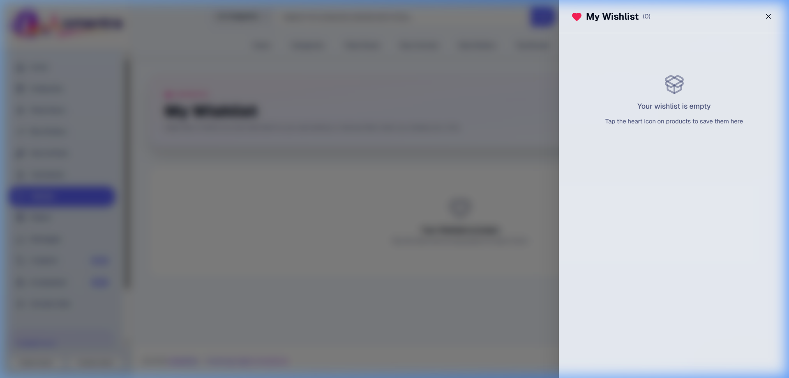</td>
</tr>
<tr>
<td align="center"><b>📦 Product Detail Modal</b></td>
<td align="center"><b>🛒 Cart Drawer</b></td>
<td align="center"><b>❤️ Wishlist</b></td>
</tr>
</table>

---

### 🎰 Gamified Coupon System

<table>
<tr>
<td>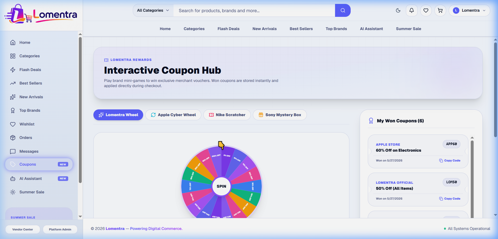</td>
<td>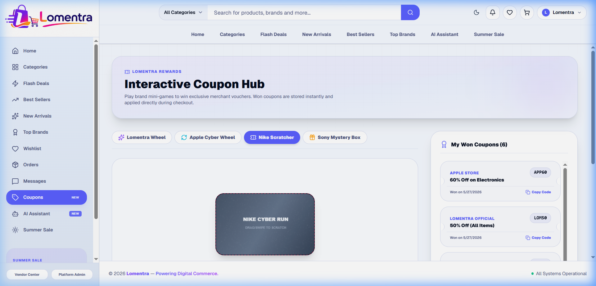</td>
<td>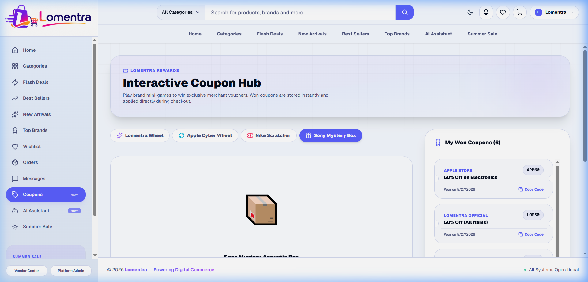</td>
</tr>
<tr>
<td align="center"><b>🎡 Spin-the-Wheel</b></td>
<td align="center"><b>🃏 Scratch Cards</b></td>
<td align="center"><b>🎁 Mystery Box</b></td>
</tr>
</table>

---

### 🤖 AI Assistant & Messaging

<table>
<tr>
<td>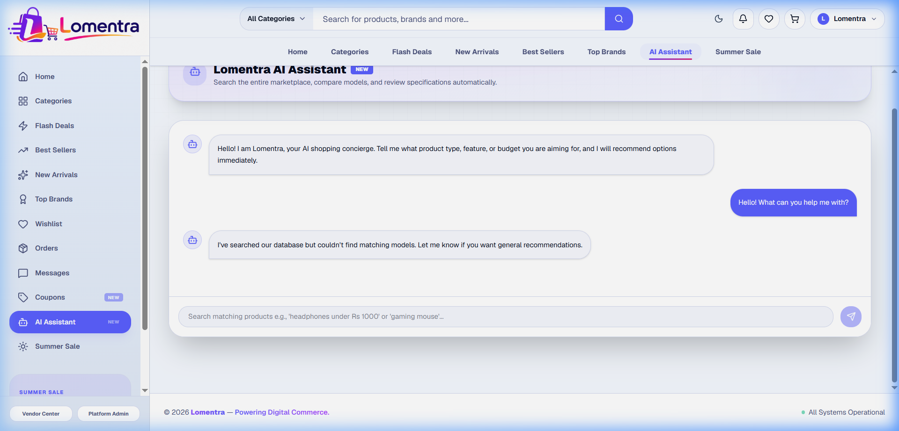</td>
</tr>
<tr>
<td align="center"><b>🤖 AI Shopping Assistant</b></td>
</tr>
</table>

---

### 🏪 Vendor Dashboard

<table>
<tr>
<td>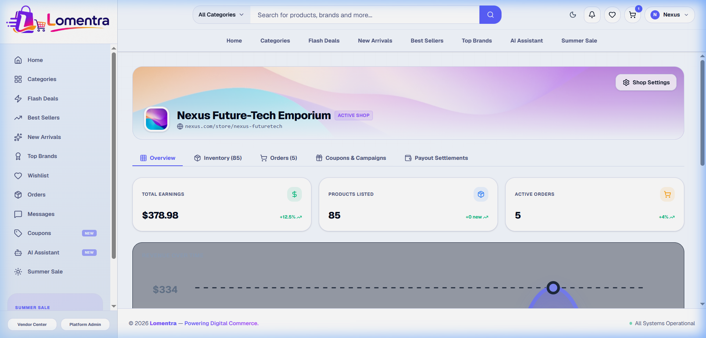</td>
<td>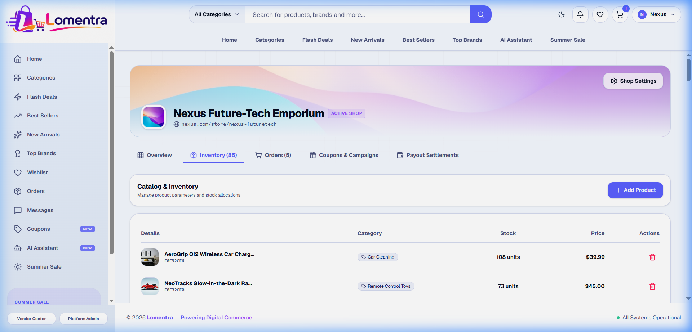</td>
<td>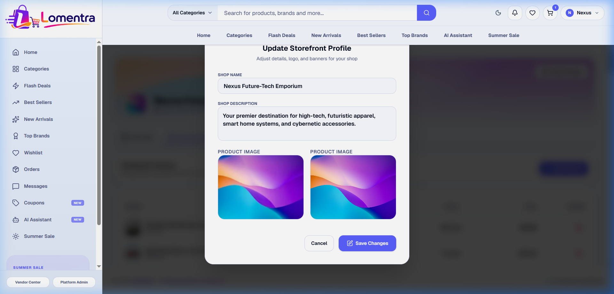</td>
</tr>
<tr>
<td align="center"><b>📊 Analytics Overview</b></td>
<td align="center"><b>📦 Product Management</b></td>
<td align="center"><b>⚙️ Store Settings</b></td>
</tr>
</table>

---

### 🛡️ Platform Admin Console

<table>
<tr>
<td></td>
<td>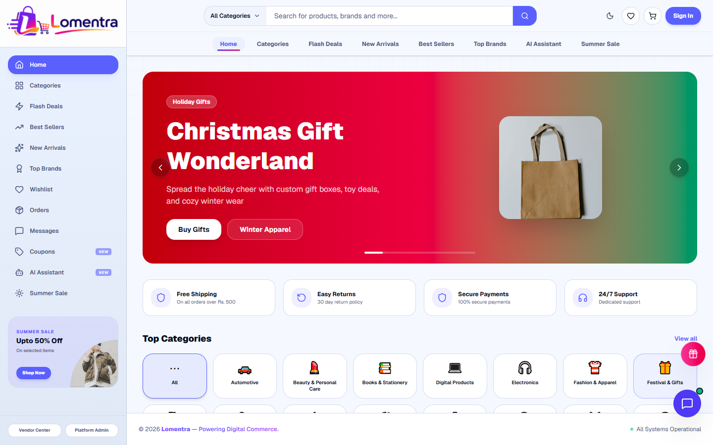</td>
</tr>
<tr>
<td align="center"><b>🔐 Admin Login</b></td>
<td align="center"><b>📊 Platform Master Console</b></td>
</tr>
</table>

---

### 👤 Customer Account

<table>
<tr>
<td>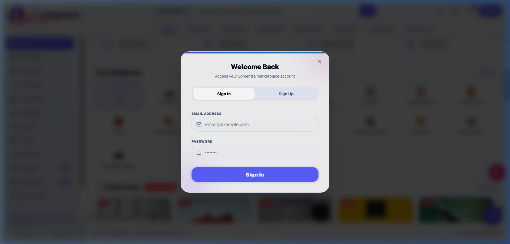</td>
<td>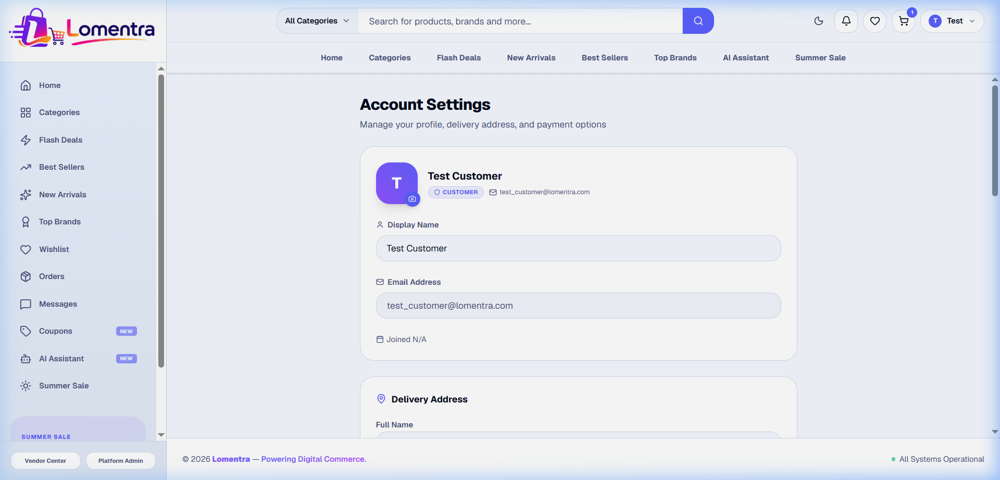</td>
</tr>
<tr>
<td align="center"><b>🔑 Sign In / Sign Up</b></td>
<td align="center"><b>👤 Customer Profile</b></td>
</tr>
</table>

---

## 🚀 Live Demo & Links

| Resource | URL |
|----------|-----|
| 🌐 **Live Storefront** | [https://lomentramarket.netlify.app/](https://lomentramarket.netlify.app/) |
| 📦 **GitHub Repository** | [https://github.com/lomashsrivastava/Lomentra-Multivendor-Ecommerce](https://github.com/lomashsrivastava/Lomentra-Multivendor-Ecommerce) |

---

## 🔑 Test Credentials

> 💡 **Email = Password** for all test accounts — easy to remember!

| Role | Email | Password |
|------|-------|----------|
| 🛡️ **Platform Admin** | `admin@lomentra.com` | `admin@lomentra.com` |
| 🏪 **Vendor** | `vendor@nexus.com` | `vendor@nexus.com` |
| 🛒 **Customer** | Register via Sign Up | Your choice |

> **Reset credentials anytime:** `GET https://your-render-url.onrender.com/api/seed`

---

## 💻 Local Development

### Prerequisites
- Node.js ≥ 18
- MongoDB Atlas account (free tier works)
- Git

### Step 1 — Clone & Install

```bash
git clone https://github.com/lomashsrivastava/Lomentra-Multivendor-Ecommerce.git
cd Lomentra-Multivendor-Ecommerce

# Install root dependencies
npm install
```

### Step 2 — Configure Backend Environment

```bash
cd backend
cp .env.example .env
```

Edit `backend/.env`:

```env
MONGODB_URI=mongodb+srv://<user>:<password>@cluster0.mongodb.net/lomentra
JWT_SECRET=your_super_secret_jwt_key_here
NODE_ENV=development
```

### Step 3 — Install Frontend & Backend Dependencies

```bash
# Backend
cd backend && npm install && cd ..

# Frontend
cd frontend && npm install && cd ..
```

### Step 4 — Start Development Servers

```bash
# Terminal 1 — Backend (http://localhost:3000)
npm run dev:backend

# Terminal 2 — Frontend (http://localhost:5176)
npm run dev:frontend
```

### Step 5 — Seed the Database

Open your browser and navigate to:
```
http://localhost:3000/api/seed
```

This creates default admin, vendor, sample products, and all categories.

---

## ☁️ Deployment Guide

### Deploy Backend to Render

**Step 1 — Create a Render Account**
- Go to [render.com](https://render.com) and sign up (free tier available)

**Step 2 — Connect GitHub Repository**
1. Click **"New +"** → **"Web Service"**
2. Connect your GitHub account
3. Select the repository: `lomashsrivastava/Lomentra-Multivendor-Ecommerce`

**Step 3 — Configure the Service**

| Setting | Value |
|---------|-------|
| **Name** | `lomentra-backend` |
| **Root Directory** | `backend` |
| **Runtime** | `Node` |
| **Build Command** | `npm install && npm run build` |
| **Start Command** | `npm start` |
| **Plan** | Free |

**Step 4 — Set Environment Variables**

In the Render dashboard under **Environment**, add:

| Key | Value |
|-----|-------|
| `NODE_ENV` | `production` |
| `MONGODB_URI` | Your MongoDB Atlas connection string |
| `JWT_SECRET` | Any long random string (e.g. `openssl rand -hex 64`) |
| `NEXTAUTH_SECRET` | Any long random string |

**Step 5 — Deploy**
- Click **"Create Web Service"**
- Render will build and deploy automatically
- Your backend URL will be: `https://lomentra-backend.onrender.com`

**Step 6 — Seed the Production Database**
```
GET https://lomentra-backend.onrender.com/api/seed
```

---

### Deploy Frontend to Netlify

**Step 1 — Create a Netlify Account**
- Go to [netlify.com](https://netlify.com) and sign up (free tier available)

**Step 2 — Connect GitHub Repository**
1. Click **"Add new site"** → **"Import an existing project"**
2. Connect GitHub → select `lomashsrivastava/Lomentra-Multivendor-Ecommerce`

**Step 3 — Configure Build Settings**

| Setting | Value |
|---------|-------|
| **Base directory** | `frontend` |
| **Build command** | `npm run build` |
| **Publish directory** | `frontend/dist` |

> ℹ️ These are already set in `frontend/netlify.toml` — Netlify will auto-detect them.

**Step 4 — The `netlify.toml` Already Handles Everything**

The `frontend/netlify.toml` file in the repo automatically:
- ✅ Sets build settings
- ✅ Proxies `/api/*` calls to `https://lomentra-backend.onrender.com`
- ✅ Configures SPA fallback for React Router

**Step 5 — Deploy**
- Click **"Deploy site"**
- Your frontend will be live at: `https://lomentramarket.netlify.app/`

---

## 📁 Project Structure

```
Lomentra-Multivendor-Ecommerce/
│
├── 📂 frontend/                    # Vite + React Storefront
│   ├── 📂 src/
│   │   ├── 📂 pages/               # Route-level page components
│   │   │   ├── Home.tsx            # Homepage with banner carousel
│   │   │   ├── CategoriesPage.tsx  # Full category browser
│   │   │   ├── FlashDealsPage.tsx  # Flash deals catalog
│   │   │   ├── BestSellersPage.tsx # Best sellers grid
│   │   │   ├── NewArrivalsPage.tsx # New arrivals listing
│   │   │   ├── TopBrandsPage.tsx   # Brand storefront pages
│   │   │   ├── SummerSalePage.tsx  # Seasonal sale page
│   │   │   ├── CouponsPage.tsx     # Gamified coupons (spin/scratch/mystery)
│   │   │   ├── WishlistPage.tsx    # Customer wishlist
│   │   │   ├── CustomerOrders.tsx  # Order history & tracking
│   │   │   ├── ProfilePage.tsx     # Customer profile & settings
│   │   │   ├── VendorDashboard.tsx # Full vendor management panel
│   │   │   ├── AdminDashboard.tsx  # Platform admin console
│   │   │   ├── AIAssistantPage.tsx # AI shopping assistant
│   │   │   └── MessagesPage.tsx    # Customer-vendor messaging
│   │   ├── 📂 components/          # Reusable UI components
│   │   │   ├── ProductDetailModal.tsx
│   │   │   ├── CheckoutModal.tsx
│   │   │   ├── CartDrawer.tsx
│   │   │   ├── DashboardCharts.tsx
│   │   │   └── ...
│   │   ├── 📂 providers/           # React Context providers
│   │   │   ├── AuthProvider.tsx    # JWT auth + user state
│   │   │   └── CartProvider.tsx    # Shopping cart state
│   │   ├── 📂 hooks/               # Custom React hooks
│   │   ├── 📂 layouts/             # Page layout wrappers
│   │   └── App.tsx                 # Root router
│   └── netlify.toml                # Netlify deployment config
│
├── 📂 backend/                     # Next.js 16 API Gateway
│   ├── 📂 src/
│   │   ├── 📂 app/
│   │   │   ├── 📂 api/             # REST API routes
│   │   │   │   ├── 📂 auth/        # login, register, logout, me
│   │   │   │   ├── 📂 products/    # CRUD + paginated listing
│   │   │   │   ├── 📂 categories/  # Category tree
│   │   │   │   ├── 📂 orders/      # Place, track, cancel orders
│   │   │   │   ├── 📂 store/       # Vendor store management
│   │   │   │   ├── 📂 admin/       # Platform admin: ledger, orders
│   │   │   │   ├── 📂 payouts/     # Vendor payout requests
│   │   │   │   ├── 📂 analytics/   # Vendor + admin analytics
│   │   │   │   ├── 📂 wishlist/    # Customer wishlist
│   │   │   │   ├── 📂 ai/          # AI chat endpoint
│   │   │   │   ├── 📂 health/      # Health check for Render
│   │   │   │   └── 📂 seed/        # Database seeder
│   │   │   └── page.tsx            # API developer hub dashboard
│   │   ├── 📂 database/
│   │   │   └── 📂 models/          # Mongoose schemas
│   │   │       ├── User.ts
│   │   │       ├── Product.ts
│   │   │       ├── Order.ts
│   │   │       ├── Store.ts
│   │   │       ├── Category.ts
│   │   │       └── ...
│   │   ├── 📂 lib/
│   │   │   └── dbConnect.ts        # MongoDB Atlas connection
│   │   ├── 📂 middleware/          # Rate limiter
│   │   └── 📂 security/            # Input sanitization
│   ├── .env.example                # Environment template
│   ├── render.yaml                 # Render deployment config
│   └── next.config.ts              # CORS + security headers
│
├── 📂 screenshots/                 # Platform screenshots (40+ images)
├── .gitignore
├── package.json                    # Monorepo scripts
└── README.md
```

---

## 📡 API Reference

### Authentication
| Method | Endpoint | Description |
|--------|----------|-------------|
| `POST` | `/api/auth/register` | Register new user (customer or vendor) |
| `POST` | `/api/auth/login` | Login and receive JWT token |
| `POST` | `/api/auth/logout` | Clear auth cookie |
| `GET` | `/api/auth/me` | Get current user from JWT |

### Storefront
| Method | Endpoint | Description |
|--------|----------|-------------|
| `GET` | `/api/products` | List products (paginated, filterable) |
| `GET` | `/api/categories` | Full category tree |
| `GET` | `/api/wishlist` | Get customer wishlist |
| `POST` | `/api/wishlist` | Add to wishlist |
| `DELETE` | `/api/wishlist` | Remove from wishlist |

### Orders & Checkout
| Method | Endpoint | Description |
|--------|----------|-------------|
| `POST` | `/api/orders` | Place a new order |
| `GET` | `/api/orders/my` | Get customer order history |
| `POST` | `/api/orders/cancel` | Cancel a pre-shipped order |
| `GET` | `/api/orders/merchant` | Vendor: view incoming orders |

### Vendor
| Method | Endpoint | Description |
|--------|----------|-------------|
| `GET/POST/PUT` | `/api/products` | Manage vendor products |
| `GET/PUT` | `/api/store/my` | Manage store profile |
| `POST` | `/api/payouts` | Request a withdrawal |
| `GET` | `/api/analytics/vendor` | Vendor sales analytics |
| `GET/POST/DELETE` | `/api/coupons` | Manage discount coupons |

### Admin
| Method | Endpoint | Description |
|--------|----------|-------------|
| `GET` | `/api/admin/ledger` | Platform split-payment ledger |
| `POST` | `/api/admin/ledger` | Disburse pending payouts |
| `GET` | `/api/admin/orders` | All platform orders |
| `GET/PUT` | `/api/payouts` | View/approve/reject withdrawals |
| `GET` | `/api/analytics/admin` | Platform-wide GMV analytics |

### Utility
| Method | Endpoint | Description |
|--------|----------|-------------|
| `GET` | `/api/seed` | Seed DB with test data & reset credentials |
| `GET` | `/api/health` | Health check (DB connectivity) |

---

## 🛡️ Security Features

- **JWT Authentication** — 7-day tokens, HttpOnly cookies
- **Password Hashing** — bcryptjs with cost factor 10–12
- **NoSQL Injection Prevention** — input sanitization on all API routes
- **Rate Limiting** — IP-based rate limiting on auth and health endpoints
- **Security Headers** — X-Frame-Options, HSTS, X-Content-Type-Options, CSP
- **CORS** — configured per-domain with credentials support

---

## 📄 License

This project is licensed under the **MIT License** — see the [LICENSE](LICENSE) file for details.

---

<div align="center">

**⭐ If you found this project helpful, please give it a star!**

Built with ❤️ using **React 19**, **Next.js 16**, **MongoDB Atlas**, and **TypeScript**

**🔗 Live:** [lomentramarket.netlify.app](https://lomentramarket.netlify.app/) &nbsp;|&nbsp; **📦 GitHub:** [Lomentra-Multivendor-Ecommerce](https://github.com/lomashsrivastava/Lomentra-Multivendor-Ecommerce)

</div>
